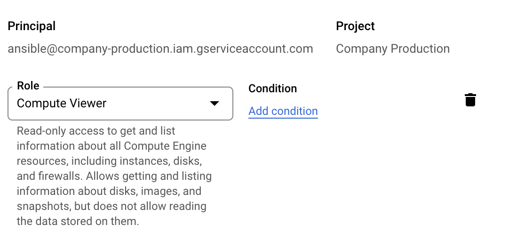

# Ansible

Ansible is a simple IT automation system. It handles configuration management, application deployment, cloud provisioning, ad-hoc task execution, network automation, and multi-node orchestration. [More information on the Ansible documentation.](https://docs.ansible.com/ansible/latest/index.html)

## Configure Ansible for AWS

Create an EC2 role with required permissions so Ansible can read EC2 system information via the AWS API. Attach this role to the EC2 instance where Ansible is installed.

 (1).png>)

Install Ansible on EC2 instance an prepare configuration files&#x20;

**ansible.cfg**

```
[inventory]
enable_plugins = auto

[defaults]
inventory = eu-west-1.aws_ec2.yaml
deprecation_warnings = False
```

**aws\_ec2.yaml**

```
---

plugin: aws_ec2

regions:
  - eu-west-1

filters:
  instance-state-name : running

hostnames:
  - tag:Name
```

**eu-west-1.aws\_ec2.yaml**

```
---
plugin: aws_ec2
regions:
  - eu-west-1
filters:
  instance-state-name : running
hostnames:
  - tag:Name
```

## **Run ansible commands**

Display the configured inventory as Ansible sees it.

```
ansible-inventory --graph
```

```

@all:
  |--@aws_ec2:
  |  |--server-1-eu-west-1.company.com
  |  |--server-2-eu-west-1.company.com
  |  |--server-3-eu-west-1.company.com
  |  |--server-4-eu-west-1.company.com
 ...
```

Get Kernel information from all hosts

```
ansible aws_ec2 --become -a 'uname -r'
```

```
server-1-eu-west-1.company.com | CHANGED | rc=0 >>
4.15.0-1045-aws
server-2-eu-west-1.company.com | CHANGED | rc=0 >>
5.4.0-1055-aws
...
```

## Configure Ansible for GCP

Create a Google Service Account with required permissions so Ansible can read GCP instance information via the API.



Install Ansible on GCP instance an prepare configuration files.

**ansible.cfg**

```
[inventory]
enable_plugins = auto
[defaults]
inventory = environment.gcp_compute.yaml
deprecation_warnings = False
```

**environment.gcp\_compute.yaml**

```
---
plugin: google.cloud.gcp_compute
projects:
  - company-production
zones:
  - europe-west1-a
  - europe-west1-b
  - europe-west1-c
  - europe-west1-d
auth_kind: serviceaccount
service_account_file: <INSTALL_PATH>/ansible/serviceaccount.json
hostnames:
  - name
filters:
  - status = RUNNING
keyed_groups:
  - prefix: gcp
    key: labels
```

**serviceaccount.json**

```
{
  "type": "service_account",
  "project_id": "company-production",
 ...
}
```

## Tagging / Grouping&#x20;

When spinning up new EC2 or GCP instances add labels to each instance. Ansible will use this labels to create groups. When running ansible commands you can use this groups to execute commands only on a subset of servers.

Terraform Snippet for adding labels

```
  labels = {
    datastore = var.node_type
    environment = var.environment
  }
```
