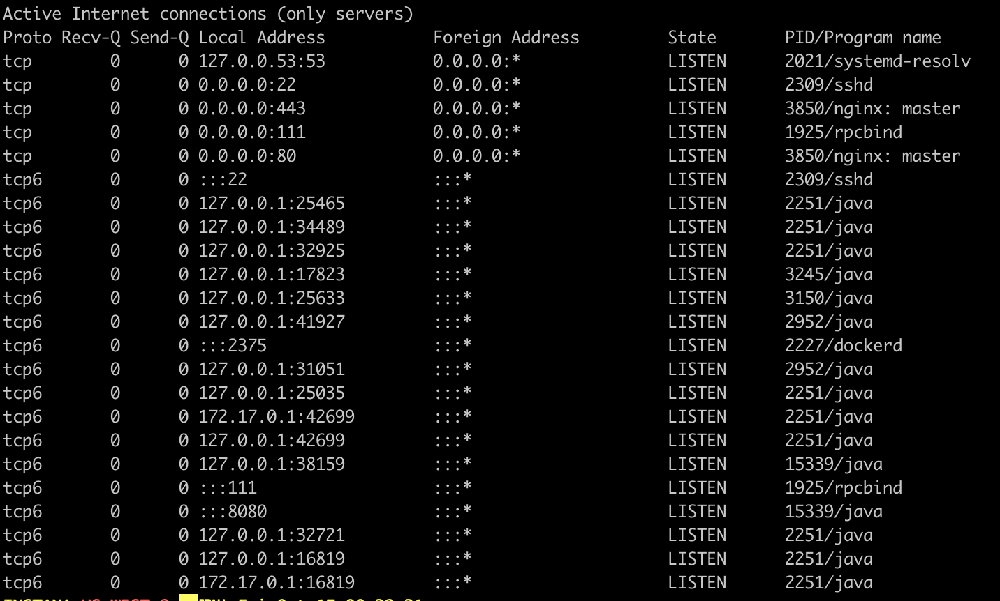

# Basic commands

## curl

Transfer data from or to a server. Supported protocols: HTTP, HTTPS, FTP, FTPS, IMAP, LDAP, TELNET, ...)

1. HTTP GET data websites
2. Send HTTP GET/PUT/DELETE/POST data to REST APIs

```
# returns your public IP, useful for debugging NAT issues
curl ifconfig.co

# pass HTTP Authorization to GET request
curl --location --request GET https://<fqdn>/api/resource --header "Authorization: apiToken <token>"
```

## dig

1. Perform DNS lookups
2. Find host addresses, IP addresses, CNAMEs, name servers, and more
3. Verify Internet connectivity

```
// Basic syntax
dig Hostname
dig DomaiNameHere
dig @DNS-server-name Hostname
dig @DNS-server-name IPAddress
```

## ip

Internet Protocol. IP is the transport layer protocol used by the Internet protocol family.

```
# list IPv4 addresses
ip -4 addr

# list IPv6 addresses
ip -6 addr

# display IP routing table
ip route 
```

## traceroute

Print the route packets take to network host. This command is useful when you want to know all the hops that a packet takes to a destination.

```
traceroute google.com

traceroute to google.com (142.250.186.78), 64 hops max, 52 byte packets
 1  fritz.box (192.168.178.1)  7.213 ms  12.731 ms  6.556 ms
 2  p3e9bf1d5.dip0.t-ipconnect.de (62.155.241.213)  13.310 ms  12.742 ms  12.688 ms
 3  217.5.118.30 (217.5.118.30)  24.326 ms  22.746 ms  24.456 ms
 4  80.156.160.118 (80.156.160.118)  22.843 ms  23.985 ms  23.408 ms
 5  * * *
 6  108.170.252.65 (108.170.252.65)  19.611 ms  19.696 ms
    142.250.62.150 (142.250.62.150)  18.584 ms
 7  * * *
 8  fra24s05-in-f14.1e100.net (142.250.186.78)  19.666 ms  21.203 ms  20.559 ms
```

## ifconfig

Configure network interface parameters.

```
# list all network interfaces
ifconfig
lo0: flags=8049<UP,LOOPBACK,RUNNING,MULTICAST> mtu 16384
	options=1203<RXCSUM,TXCSUM,TXSTATUS,SW_TIMESTAMP>
	inet 127.0.0.1 netmask 0xff000000
	inet6 ::1 prefixlen 128
	inet6 fe80::1%lo0 prefixlen 64 scopeid 0x1
	nd6 options=201<PERFORMNUD,DAD>
gif0: flags=8010<POINTOPOINT,MULTICAST> mtu 1280
stf0: flags=0<> mtu 1280
ap1: flags=8802<BROADCAST,SIMPLEX,MULTICAST> mtu 1500
	options=400<CHANNEL_IO>
	ether f2:18:98:0c:86:99
	media: autoselect
	status: inactive
en0: flags=8863<UP,BROADCAST,SMART,RUNNING,SIMPLEX,MULTICAST> mtu 1500
	options=400<CHANNEL_IO>
	ether f0:18:98:0c:86:99
	inet 192.168.178.49 netmask 0xffffff00 broadcast 192.168.178.255
	media: autoselect
	status: active
...

# view interface details 
ifconfig en0
en0: flags=8863<UP,BROADCAST,SMART,RUNNING,SIMPLEX,MULTICAST> mtu 1500
	options=400<CHANNEL_IO>
	ether f0:18:98:0c:86:99
	inet 192.168.178.49 netmask 0xffffff00 broadcast 192.168.178.255
	media: autoselect
	status: active
	
# enable interface 
ifconfig en0 up

# disable interface
ifconfig en0 down

# assign IP to network interface 
ifconfig en0 192.168.178.42

# assign netmask to network interface 
ifconfig en0 netmask 255.255.255.224

# change maximum transmission unit (MTU) for network interface. MTU allows you to set the limit size of packets that are transmitted on a network interface.
ifconfig en0 mtu 1000
```

## tcpdump

```
# traffic overview 
tcpdump

# traffic by host
tcpdump "src host server.company.com"

# write incoming traffic by host packages to file
tcpdump "src host server.company.com" -w /tmp/server.company.com.dump

# write outgoing traffic by host packages to file
tcpdump "dst host server-2.company.com" -w /tmp/server-2.company.com

# write 5 sec of TCP traffic to file
timeout 5 tcpdump "(dst host elastic-1.company.com or dst host elastic-2.company.com or dst host elastic-3.company.com)" -w /tmp/elastic-server.company.com.dump
```

## Port Forwarding

Use port forwarding to bind port from other host to localhost

```
ssh -i ~/.ssh/id_ed25519 -Nf -L 8080:localhost:8080 marcel@domain.example.com
```

## netstat

Show which interface/port a process (PID) is using

```
netstat -tnlp
```



## iptraf

Interactive Colorful IP LAN Monitor

.png>)

## systemd-resolve

Resolve domain names, IPV4 and IPv6 addresses, DNS resource records, and services.

```
systemd-resolve --status
Global
          DNSSEC NTA: 10.in-addr.arpa
                      16.172.in-addr.arpa
                      168.192.in-addr.arpa
                      ...
                      27.172.in-addr.arpa
                      28.172.in-addr.arpa
lines 1-16...skipping...
Global
          DNSSEC NTA: 10.in-addr.arpa
                      16.172.in-addr.arpa
                      168.192.in-addr.arpa
                      17.172.in-addr.arpa
                      ...
                      30.172.in-addr.arpa
                      31.172.in-addr.arpa
                      corp
                      d.f.ip6.arpa
                      home
                      internal
                      intranet
                      lan
                      local
                      private
                      test

Link 158 (tun0)
      Current Scopes: none
       LLMNR setting: yes
MulticastDNS setting: no
      DNSSEC setting: no
    DNSSEC supported: no

Link 149 (docker0)
      Current Scopes: none
       LLMNR setting: yes
MulticastDNS setting: no
      DNSSEC setting: no
    DNSSEC supported: no

Link 2 (ens4)
      Current Scopes: DNS
       LLMNR setting: yes
MulticastDNS setting: no
      DNSSEC setting: no
    DNSSEC supported: no
         DNS Servers: 169.254.169.254
          DNS Domain: europe-west1-b.c.XXXXXX.internal
                      c.XXXXXX.internal
                      google.internal
```

